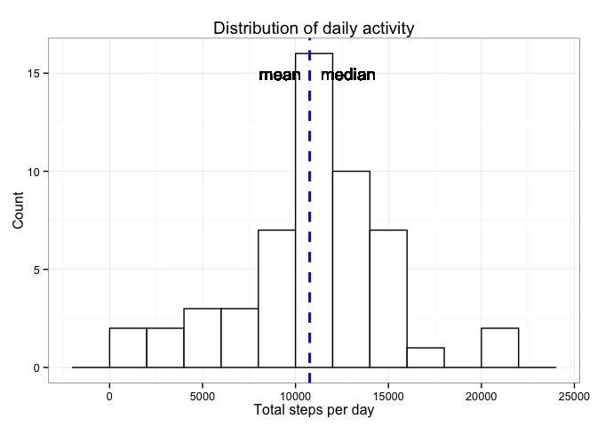
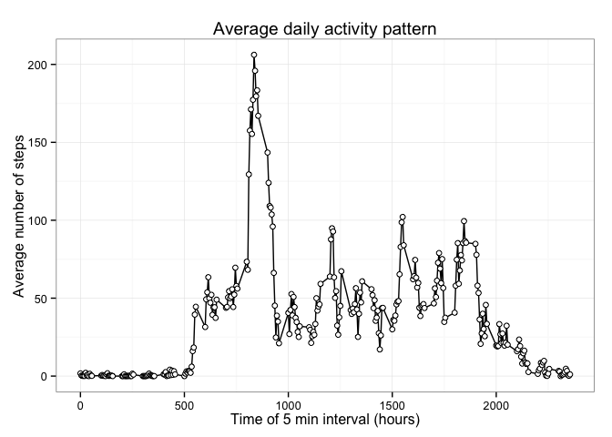
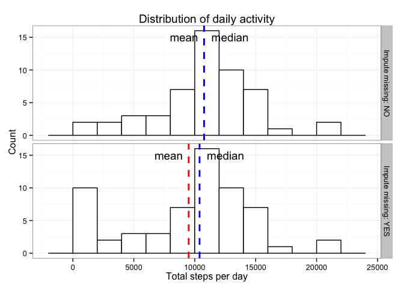
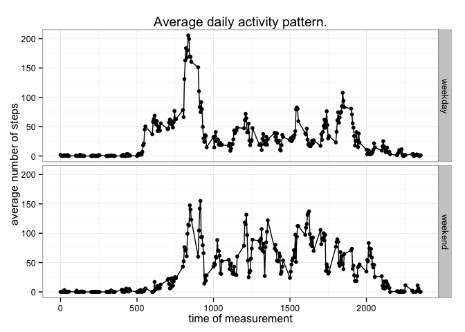

# Reproducible Research: Peer Assessment 1

## Introduction

It is now possible to collect a large amount of data about personal
movement using activity monitoring devices such as a
[Fitbit](http://www.fitbit.com), [Nike
Fuelband](http://www.nike.com/us/en_us/c/nikeplus-fuelband), or
[Jawbone Up](https://jawbone.com/up). These type of devices are part of
the "quantified self" movement -- a group of enthusiasts who take
measurements about themselves regularly to improve their health, to
find patterns in their behavior, or because they are tech geeks. But
these data remain under-utilized both because the raw data are hard to
obtain and there is a lack of statistical methods and software for
processing and interpreting the data.

This analysis makes use of data from a personal activity monitoring
device. This device collects data at 5 minute intervals through out the
day. The data consists of two months of data from an anonymous
individual collected during the months of October and November, 2012
and include the number of steps taken in 5 minute intervals each day.

## Loading and preprocessing the data


```r
library(dplyr)
library(lubridate)
library(stringr)
library(ggplot2)
```


The data is available in the github repository as activity.zip. 

*Transformation*:

 - Convert ```date``` column to date format.
 - The ```interval``` column contains the interval expressed in increment of 5 minutes, create a new column ```full_date``` by concatenating date and interval to have the date and time of the measurement.


```r
activity <- read.table(unzip("activity.zip"), sep = ",", header=TRUE, 
                       na.strings = 'NA', stringsAsFactors=FALSE)

activity <- activity %>%
    mutate(full_date = str_pad(interval, 4, pad="0")) %>%
    mutate(full_date = gsub('^(.{2})(.*)$', '\\1:\\2', full_date)) %>%
    mutate(full_date = ymd_hm(paste(date, full_date, sep = " "))) %>%
    mutate(date = ymd(date))

str(activity)
```

```
## 'data.frame':	17568 obs. of  4 variables:
##  $ steps    : int  NA NA NA NA NA NA NA NA NA NA ...
##  $ date     : POSIXct, format: "2012-10-01" "2012-10-01" ...
##  $ interval : int  0 5 10 15 20 25 30 35 40 45 ...
##  $ full_date: POSIXct, format: "2012-10-01 00:00:00" "2012-10-01 00:05:00" ...
```

*Conventioned used for naming variables*:

- group_by(date) suffix -> _daily
- group_by(interval) suffix -> _time
- impute missing values prefix -> nm_

Statistics are calculate using daily average or interval average.

## What is mean total number of steps taken per day?

Group all measurement per day and calulate the total number of steps per day.


```r
act_daily <- activity %>%
    group_by(date) %>%
    summarize(daily_total = sum(steps),
              daily_mean = mean(steps, na.rm = TRUE),
              daily_median = median(steps, na.rm = TRUE))
```


 


The mean number of steps per day is **10766** and the median **10765**. The two values are practivally equal.


## What is the average daily activity pattern?

Average of the activity pattern across all available days. 

Summarize standard deviation, standard error and approcimation of 95% confidence interval for each measurement.


```r
act_time <- activity %>%
    group_by(interval) %>%
    summarize(n=n(),
              steps_mean = mean(steps, na.rm = TRUE),
              steps_median = median(steps, na.rm = TRUE),
              steps_sd = sd(steps, na.rm = TRUE)) %>%
    mutate(   steps_se = steps_sd/sqrt(n),            # standard error
              lci = steps_mean+qnorm(0.025)*steps_se, # lower confidence index
              uci = steps_mean+qnorm(0.975)*steps_se)
```

 


On average, the maximum number of steps is taken during the **08:35** 5 minutes interval .


## Imputing missing values


There are a number of days/intervals where there are missing values (coded as NA). The presence of missing days may introduce bias into some calculations or summaries of the data.

The activity dataset has 17568 observations, containing **2304** missing values. In the new dataset ```nm_activity``` missing values are imputed by using the median for that interval across all daily measures.


```r
nm_activity <- activity %>%
    mutate(steps = 
               ifelse(is.na(steps), 
                      act_time[act_time$interval==interval]$steps_median, 
                      steps))
nm_act_daily <- nm_activity %>%
    group_by(date) %>%
    summarise(daily_mean = mean(steps), 
              daily_median = median(steps), 
              daily_total = sum(steps))
```


 

With the imputed values the mean number of steps per day is 9504 and the median 10395. The two values are no longer equals and the mean has varied by -11.7% and the median by -3.4% when compared to the original dataset.


## Are there differences in activity patterns between weekdays and weekends?

Using the dataset with filled-in missing values a new factor variable weekday/weekend is created, allowing the comparison of average activity pattern through the day between weekend and weekdays.


```r
nm_activity <- nm_activity %>%
    mutate(day = wday(date),
           weekend = ifelse(day==1 | day==7, "weekend", "weekday"))

nm_act_time <- nm_activity %>%
    group_by(interval, weekend) %>%
    summarize(steps_mean = mean(steps))
```

 


During the week, there is a peak of activity around 8h30, and a small pead at the end of the working day, during the day there is little activity. While during weekends, the peak around 8am is not as pronounced and there is a more constant activity throughout the day.
